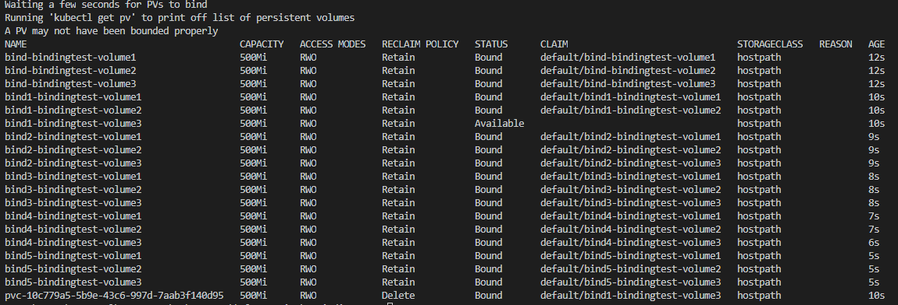

# PVBindingTest
Used to help reproduce Docker+K8S PV binding issue

## Requires
 - Windows 10
 - Docker Desktop for Windows
   - Kubernetes Enabled
 - Helm 3

## To Run

``` powershell
test.ps1
```

## To Cleanup

``` powershell
teardown.ps1
```

## Output Observered

